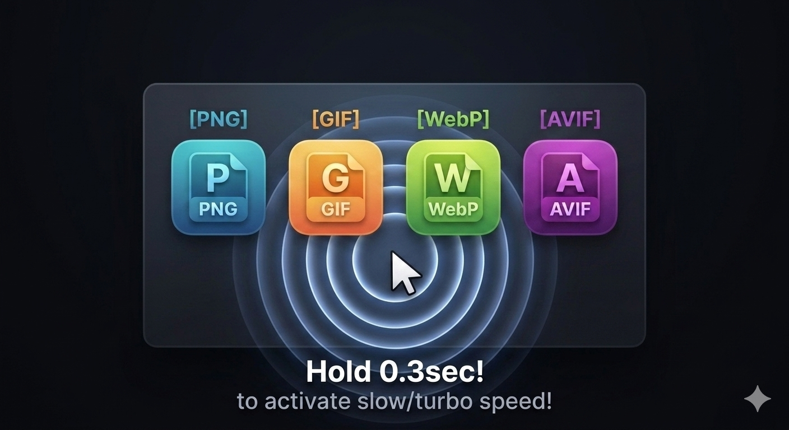

  

# PicSpeeder 🚀

A Chrome Extension to control image animation frames and adjust playback speed via simple long-press gestures.

## Features
- **Frame Control**: Long-press an image to view individual frames (PNG, GIF, WebP, AVIF).
- **Speed Adjustment**: Two multi-layered speed sliders (Linear adjustment & Multiplier steps) combining up to extreme slow/fast motion.
- **CORS/CSP Bypass**: Secure background fetching that works seamlessly on almost any website or top-level image document.
- **Noise Filter**: Blocks casual clicks (100ms delay) and automatically overrides heavy host CSS styles to keep the UI uniform.

## How to Install (For Users)

Since this extension is distributed via GitHub, you can load it directly into your Chrome browser as a developer:

1. **Download the source code**: Click the green **"Code"** button on this repository page, and select **"Download ZIP"**.
2. **Extract the ZIP**: Unzip the downloaded file somewhere safe on your computer.
3. **Open Extensions Page**: Open Google Chrome and navigate to `chrome://extensions/` in your address bar.
4. **Enable Developer Mode**: Turn on the **"Developer mode"** toggle switch in the top-right corner.
5. **Load the Extension**: Click the **"Load unpacked"** button in the top-left corner.
6. **Select the Folder**: Select the unzipped folder containing `manifest.json`.

Done! Now open any webpage, find an animated image, and **hold left-click for 300ms** to unleash **PicSpeeder**!
